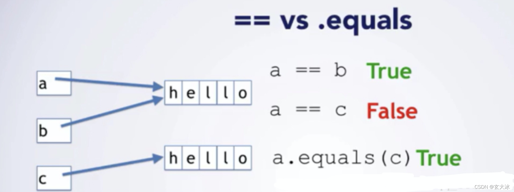
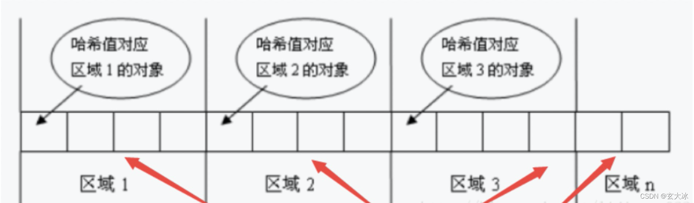

目录

一、回顾下==和equals的区别

二、再复习下equals()和hashCode()的关系

三、来看看EqualsAndHashCode（lombok）

四、来看看@Data

分享一道实习生的面试题，大家是否真的搞清楚了这块知识？

一、回顾下==和equals的区别

如上图所示，简单来说，==是判断两个变量或实例是不是指向同一个内存空间，equals是判断两个变量或实例所指向的内存空间的值是不是相同。

二、再复习下equals()和hashCode()的关系
重写equals()
大部分使用场景里面，2个对象比较，更多的是关注对象的各个字段值是否相等。这时候就需要重写equals()方法。

重写hashCode()
为什么需要重写hashcode()呢？因为我们不知道对象在内存中的存放方式。
试想一下，如果有10000个元素，用遍历方式去寻找的话，效率就太低了；为了解决这一问题，哈希算法诞生了。

哈希算法的核心思想是：
将集合分成若干个存储区域（可以看成一个个桶），每个对象可以计算出一个哈希码，可以根据哈希码分组，每组分别对应某个存储区域，这样一个对象根据它的哈希码就可以分到不同的存储区域（不同的区域）。

理想情况下我们只需要比较hash值，就可以确定对象是否相等；但是，学过数据结构的都会知道哈希冲突这个概念，简单理解就是多个对象的哈希值可能相等，所以就需要我们再比较哈希值的基础之上，在进行equals()方法比较；

综上所述，元素比较的流程就是：先比较哈希值，再调用equals()。
这也是为什么equals()方法要和hashcode()一起重写；因为equals()中需要比较哈希值，而哈希值的生成方式又涉及hasdcode()方法。

三、来看看EqualsAndHashCode（lombok）
@EqualsAndHashCode
默认对类的所有字段实现equals()和hashCode()方法

@EqualsAndHashCode(of={"id", "age"}, exclude = {"name"})
指定字段，排除字段

@EqualsAndHashCode(callSuer=true)
覆盖父类字段

四、来看看@Data
简单来说，@Data就是以下5个注解的集合。但是如果需要自定义一些特征，就需要分别使用各个注解。

/**
* @see Getter
* @see Setter
* @see RequiredArgsConstructor
* @see ToString
* @see EqualsAndHashCode
* @see lombok.Value
  */
  @Target(ElementType.TYPE)
  @Retention(RetentionPolicy.SOURCE)
  public @interface Data {
  参考文章：
  ​​​​​​Equals()与hashcode()方法_高冷小伙的博客-CSDN博客【lombok】@EqualsAndHashCode - 相等更简单：从对象的字段生成hashCode和equals实现_Amos-Chen的博客-CSDN博客​​​​​​Equals()与hashcode()方法_高冷小伙的博客-CSDN博客
  ————————————————
  版权声明：本文为CSDN博主「玄大冰」的原创文章，遵循CC 4.0 BY-SA版权协议，转载请附上原文出处链接及本声明。
  原文链接：https://blog.csdn.net/welcome_zhang/article/details/123691833